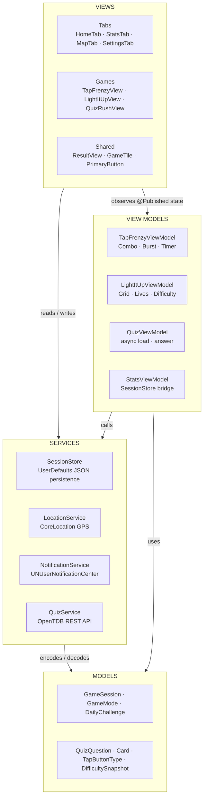

# GameVault — iOS Gaming Hub

> A polished, multi-game iOS application built with SwiftUI across 4 weeks of coursework.  
> Tap Frenzy · Light It Up · Quiz Rush

---

## Table of Contents

- [Overview](#overview)
- [Screenshots](#screenshots)
- [Tech Stack](#tech-stack)
- [Architecture](#architecture)
- [Folder Structure](#folder-structure)
- [Features by Week](#features-by-week)
- [Setup & Running](#setup--running)
- [Known Limitations](#known-limitations)
- [Reflection](#reflection)

---

## Overview

GameVault is a native iOS gaming hub that houses three distinct mini-games inside a unified, dark-themed shell application. The app integrates real device capabilities — CoreLocation, UserNotifications, MapKit, SwiftUI Charts, and a live REST API — into a cohesive, production-quality experience built entirely in SwiftUI.

---

## Screenshots

<table>
  <tr>
    <td align="center"><b>🎮 Games (Home)</b></td>
    <td align="center"><b>📊 Stats</b></td>
  </tr>
  <tr>
    <td></td>
    <td></td>
  </tr>
  <tr>
    <td align="center"><b>🗺️ Map</b></td>
    <td align="center"><b>⚙️ Settings</b></td>
  </tr>
  <tr>
    <td></td>
    <td></td>
  </tr>
</table>

---

## Tech Stack

| Technology | Usage |
|---|---|
| **SwiftUI** | All UI layers — tabs, games, components |
| **Swift Concurrency (async/await)** | API fetching in QuizViewModel |
| **Combine** | Timer publishing in Tap Frenzy |
| **MapKit** | Interactive pin map in Map tab |
| **CoreLocation** | GPS coordinate capture on game completion |
| **UserNotifications** | Scheduled daily challenge reminders |
| **SwiftUI Charts** | Score history bar chart in Stats tab |
| **Open Trivia Database API** | Live trivia questions for Quiz Rush |
| **UserDefaults + JSON** | Persistent session storage via SessionStore |

---

## Architecture

GameVault follows a strict **MVVM (Model-View-ViewModel)** architecture with services extracted into dedicated singleton classes.



### Key Principles
- **Views** contain only rendering logic — no business logic, no network calls
- **ViewModels** own published state and coordinate async operations
- **Services** are singletons wrapping platform APIs (location, notifications, networking, storage)
- **Models** are pure value types (`struct`) with `Codable` conformance for persistence

---

## Folder Structure

```
IosApplicationTutorial/
├── App/
│   └── IosApplicationTutorialApp.swift     # App entry point, TabView shell
│
├── Models/
│   ├── Card.swift                            # Struct: id, isLit, CardColor enum
│   ├── DailyChallenge.swift                  # DailyChallenge struct + DailyChallengeManager (weekday rotation)
│   ├── DifficultySnapshot.swift              # Score-based difficulty algorithm for Light It Up
│   ├── GameMode.swift                        # Enum: .tapFrenzy, .lightItUp, .quizRush
│   │                                         # Properties: icon, imageName, accentColor, subtitle, category
│   ├── GameSession.swift                     # Struct: id, mode, score, timestamp, lat, lon
│   ├── QuizQuestion.swift                    # Codable struct + HTML entity decoder
│   └── TapButtonType.swift                   # Enum: .normal, .bonus, .trap for Tap Frenzy
│
├── ViewModels/
│   ├── TapFrenzyViewModel.swift             # Tap game logic, combo system, burst mode
│   ├── LightItUpViewModel.swift             # Grid game logic, progressive difficulty
│   ├── QuizViewModel.swift                  # Quiz state, async load(), answer()
│   └── StatsViewModel.swift                 # Bridges SessionStore → StatsTab
│
├── Services/
│   ├── LocationService.swift                # CLLocationManager wrapper, .coordinate
│   ├── NotificationService.swift            # UNUserNotificationCenter, daily trigger
│   ├── QuizService.swift                    # URLSession + OpenTDB API client
│   └── SessionStore.swift                   # JSON persistence in UserDefaults
│
├── Views/
│   ├── Tabs/
│   │   ├── HomeTab.swift                    # Game selector with artwork tiles
│   │   ├── StatsTab.swift                   # Dashboard: badges, chart, recent games
│   │   ├── MapTab.swift                     # MapKit pins + session detail sheet
│   │   └── SettingsTab.swift                # Notifications, data reset, about
│   │
│   ├── Games/
│   │   ├── TapFrenzy/
│   │   │   ├── TapFrenzyMenuView.swift      # Round length selector
│   │   │   └── TapFrenzyView.swift          # Tap game with combos, traps, burst mode
│   │   ├── LightItUp/
│   │   │   ├── LightItUpMenuView.swift      # Mode + round length selector
│   │   │   └── LightItUpView.swift          # Grid game, progressive difficulty
│   │   └── QuizRush/
│   │       ├── QuizMenuView.swift           # Category, difficulty, amount, timer
│   │       └── QuizView.swift               # Trivia game with streak scoring
│   │
│   ├── Shared/
│   │   └── ResultView.swift                 # Game over screen, shared by all 3 games
│   │
│   └── Components/
│       ├── GameTile.swift                   # Home screen game card with artwork
│       └── PrimaryButton.swift              # Reusable styled action button
│
└── Assets.xcassets/
    ├── tap_frenzy.imageset/                 # 3D clay game icon — Tap Frenzy
    ├── tap_frenzy_bg.imageset/              # Cinematic background art — Tap Frenzy menu
    ├── light_it_up.imageset/                # 3D clay game icon — Light It Up
    ├── light_it_up_bg.imageset/             # Cinematic background art — Light It Up menu
    ├── quiz_rush.imageset/                  # 3D clay game icon — Quiz Rush
    ├── quiz_rush_bg.imageset/               # Cinematic background art — Quiz Rush menu
    └── player_avatar.imageset/              # Cyberpunk 3D player profile portrait
```

---

## Features by Week

### Week 1 — Tap Frenzy
**Goal:** Build the smallest possible game that's fun, then make it harder.

| Feature | Description |
|---|---|
| Tap button | Large centered button that scores on tap |
| 10-second timer | `Timer.publish` countdown with live display |
| Score counter | Increments per tap, displayed prominently |
| Game Over screen | Final score display after time expires |
| High Score | Computed from `SessionStore` — single source of truth |
| **Bonus: Combo system** | Rapid taps stack multipliers for extra points |
| **Bonus: Trap buttons** | Button changes type (green = bonus, grey = trap) |
| **Bonus: Moving button** | Target relocates randomly for increasing difficulty |
| **Bonus: Burst mode** | High streaks trigger a rapid-fire scoring burst |

---

### Week 2 — Light It Up
**Goal:** Add a second game — cards appear, one lights up, tap it before it goes dark.

| Feature | Description |
|---|---|
| Grid mechanic | Cards in a fixed-size grid; one or more illuminate briefly |
| Progressive difficulty | Score-based algorithm — `cardCount`, `litWindow`, `colorCount` all scale with score |
| Multi-colour cards | Cyan, green, orange, red — unlocks at score 10+ |
| Sequence mode | At score 30+, tap cards in a specific colour order |
| Timed + Endless modes | Player chooses between countdown timer or infinite play |
| Lives system | 3 lives — miss or mis-tap costs a life |
| High Score | Computed from `SessionStore` — single source of truth |
| Menu screen | Mode selector (Timed/Endless) + round length picker |

---

### Week 3 — Quiz Rush
**Goal:** Add a third mode powered by a live API; introduce async/await and MVVM.

| Feature | Description |
|---|---|
| OpenTDB API | Fetches live trivia questions with no API key required |
| MVVM ViewModel | `QuizViewModel` manages state, loading, and error conditions |
| Loading state | Activity indicator while API request is in flight |
| Error state | Friendly error screen with retry button on network failure |
| 4 answer buttons | Correct + 3 incorrect answers shuffled randomly |
| Streak scoring | Consecutive correct answers give compounding bonus points |
| Penalty system | Wrong answers deduct points and reset streak |
| Menu customization | Select category, difficulty (easy/medium/hard), question count |

---

### Week 4 — The Real App
**Goal:** Restructure into a real app shell with tabs, persistence, location, and notifications.

| Feature | Description |
|---|---|
| TabView shell | Home, Stats, Map, Settings — all in a unified `TabView` |
| MVVM restructure | Full folder hierarchy: Models, ViewModels, Services, Views |
| GameSession model | Records id, mode, score, timestamp, and GPS coordinates |
| SessionStore | JSON-encoded UserDefaults persistence for all sessions |
| Stats tab | Filter bar, unified overview HUD (games / best score / streak), scrollable bar chart, personal bests, recent games list |
| SwiftUI Charts | Horizontally scrollable `BarMark` chart showing score history per session |
| Map tab | Clean MapKit pins (POIs excluded) for every game location; location grouping/clustering with red count badges; tap for compact scrollable callout bubble attached to pin; filterable by game |
| Settings tab | Daily notification toggle + time picker, data reset with confirmation dialog |
| ShareLink | Share score result on all three game over screens |
| Custom artwork | 3D clay-style matte game icons + cinematic background art in Home tiles and menus |
| Dark matte UI | Dark card backgrounds, clean borders, consistent accent colours per game |
| Game category filter | Home tab horizontal scroll filter (All / Action / Puzzle / Quiz / Adventure) |
| Daily Challenge card | Weekday-based quest shown on Home; challenge rotates daily across all 3 games |
| Challenge-gated streak | Streak only increments when the daily challenge is completed that day — not just any game session |
| Dynamic notifications | 7 weekday-specific reminders scheduled locally; each one displays that day's exact challenge description |

---

## Setup & Running

### Requirements
- Xcode 16+
- iOS 17+ Simulator or physical device
- macOS Sonoma or later
- No third-party package dependencies — uses only native Apple frameworks

### Steps

```bash
# Clone the repository
git clone https://github.com/PruthuviDe/IosApplicationTutorial.git
cd IosApplicationTutorial

# Open in Xcode
open IosApplicationTutorial.xcodeproj
```

1. Select a simulator target (iPhone 16 recommended)
2. Press `Cmd + R` to build and run
3. Grant **Location** and **Notifications** permissions when prompted on first launch

> **Note:** Quiz Rush requires an active internet connection to query the Open Trivia Database API.

---

## Known Limitations

| Area | Limitation |
|---|---|
| **Quiz Rush offline** | No offline fallback — shows an error screen if the OpenTDB API is unreachable |
| **Location accuracy** | Uses `kCLLocationAccuracyHundredMeters` to preserve battery; pins may appear slightly offset |
| **Simulator location** | Running on an iOS Simulator without a simulated GPS location stores `(0.0, 0.0)` — sessions appear in the ocean on the map. Physical device or a simulated location fix is required for accurate pins. |
| **Session storage limit** | All sessions stored in `UserDefaults` — not suitable for very large volumes (1000+ sessions); no iCloud sync |
| **ViewModels scope** | All 3 games use dedicated ViewModels; minor animation-timing logic remains inside `QuizView` directly |
| **No user profile** | Player name is editable in Settings and persists via `@AppStorage` — no authentication or multi-user support |
| **Combo multiplier cap** | Tap Frenzy combo multiplier has no upper bound — a very fast tap sequence can theoretically grow it unboundedly within a round |
| **Notification re-prompt** | iOS only shows the permission popup once. If the user denies notifications, the in-app toggle silently has no effect — the user must manually enable it in iOS Settings → Notifications |
| **Daily challenge reset** | The streak history is tied to the current weekday-rotation schedule. If the rotation targets are ever changed in a future update, historical streaks calculated against the old targets may be inaccurate |

---

## Reflection

When I started this project, it was my very first time working with Swift and SwiftUI. At the beginning, everything felt completely new, and I wasn't sure how far I would get. What started as a coursework assignment to build a simple game ended up growing week by week into a full app with three different games, interactive maps, progress tracking, and live internet data.

Building the first game, Tap Frenzy, taught me the basics of user interface design and handling button taps. But as I moved on to Light It Up, things got trickier trying to manage card grids, timers, and lives all at once. My lecturer’s guidance and feedback during sessions really helped me understand how to separate the game logic from the user interface so the code wouldn't turn into a mess. Whenever I hit a roadblock or got stuck on bugs, discussing ideas with my friends and classmates helped me figure out solutions and keep moving forward.

With Quiz Rush, learning how to connect the app to the internet to load real trivia questions automatically was a major step. Seeing live questions load onto the screen for the first time was a huge milestone for me.

The final phase brought everything together. Combining all three games into one main app shell with a Map tab to track where games were played, daily quest challenges, and notifications made it feel like a real, complete app.

Looking back, learning Swift and SwiftUI from scratch was a big challenge, but seeing how much the app grew from a single tap button to a complete gaming hub was incredibly rewarding. The support from my lecturer and friends made a big difference. Overall, the biggest lesson I learned is that planning is the main thing if you plan your architecture and features correctly from day one, you can easily achieve your goals and build a complex app smoothly.
